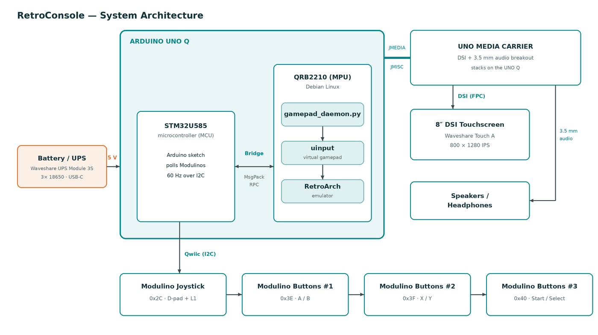

# RetroConsole — Arduino UNO Q Retro Game Console

A retro gaming console built on the Arduino UNO Q running Debian Linux, using
RetroArch for emulation with custom Modulino-based controls and an 8″ DSI
touchscreen on the UNO Media Carrier. Boots straight into the game menu —
no keyboard, no desktop.

It optionally also plays the [ARC-AGI-3](#optional-arc-agi-3-puzzle-games)
abstract-reasoning games, on the same gamepad.

Full build write-up: see the project on Arduino Project Hub.

## Architecture



(Diagram source: [`docs/architecture.py`](docs/architecture.py) — edit and re-run to regenerate.)

Each Buttons module contributes only its two **exterior** buttons — the three
buttons sit too close together for the middle one to be usable, so three
modules cover the six actions.

## Hardware

| Component | Purpose | Link |
|-----------|---------|------|
| Arduino Uno Q | Main computing unit (Cortex-A53 + STM32) | [Docs](https://docs.arduino.cc/hardware/uno-q) |
| Uno Media Carrier | DSI display output + 3.5mm audio | [Docs](https://docs.arduino.cc/hardware/uno-media-carrier/) |
| Waveshare 8" DSI touch display (8-DSI-TOUCH-A) | 800x1280 IPS display | [Wiki](https://www.waveshare.com/wiki/8-DSI-TOUCH-A) |
| Waveshare UPS Module 3S + 3x 18650 cells | Battery power / UPS | [Wiki](https://www.waveshare.com/wiki/UPS_Module_3S) |
| Adafruit mono enclosed speaker (3W 4Ω) | Speaker for the enclosed build (earpiece-amp output) | [Adafruit](https://www.adafruit.com/product/4445) |
| USB-C 2-in-1 PD + data adapter | PD power in + USB peripherals on the single USB-C port | [eMAG](https://www.emag.ro/adaptor-usb-c-cu-incarcare-pd-transfer-rapid-12cm-gri-21-typc-2in1/pd/DX295PYBM/) |
| Modulino Buttons x3 | 6 action buttons (A/B/X/Y/Start/Select), exterior pair of each module | [Docs](https://docs.arduino.cc/hardware/modulino-buttons/) |
| Modulino Joystick | Directional control | [Docs](https://docs.arduino.cc/hardware/modulino-joystick/) |

## Wiring

```
[Uno Q] --JMEDIA/JMISC--> [Media Carrier] --15pin FPC--> [Waveshare 8" DSI]
                                |
                                | 3.5mm audio out --> [Speakers/Headphones]

[Uno Q Qwiic] --> [Joystick 0x58] --> [Buttons #1 0x7C] --> [Buttons #2 0x7D] --> [Buttons #3 0x80]
```

## Button Mapping

```
Joystick X/Y   → D-pad (Up/Down/Left/Right)   [both axes inverted in daemon
                                                to match the physical mount]
Joystick Press → L1 (also Hotkey + L1 closes content)
Buttons #1     → A, B          (exterior buttons; middle unused)
Buttons #2     → X, Y          (exterior buttons; middle unused)
Buttons #3     → Start, Select (exterior buttons; middle unused)
```

### Hotkey combos

`Select` is the hotkey modifier. Hold `Select` and press:

| Combo            | Action                                                              |
|------------------|---------------------------------------------------------------------|
| Select + Start   | Toggle the in-game menu overlay                                     |
| Select + L1      | Close the running game and return to the (landscape) menu           |

Escape is **disabled** as a quit key so a stray USB keypress can't drop the
kiosk to XFCE. To actually quit RetroArch entirely: SSH in and `pkill retroarch`.

## App Lab project bundles

Pre-built zips importable directly into Arduino App Lab live in `dist/`:

- `dist/game-console.zip` — the gameplay sketch + Python skeleton
- `dist/modulino-i2c-changer.zip` — I2C address-change utility (one run per
  extra Buttons module with an explicit target address; see its README)
- `dist/bus-scanner.zip` — Qwiic bus scanner; prints ACKing addresses to the
  App Lab Monitor. Use it to verify the chain and to disarm the changer.
- `dist/recovery-changer.zip` — fixes address collisions (two modules on one
  address) one module at a time.
- `dist/button-checker.zip` — prints every button press/release with its
  gamepad role (A/B/X/Y/Start/Select, D-pad, L1) to the Monitor; standalone
  end-to-end input test before flashing the gameplay sketch.

Re-run `bash dist/build.sh` after editing any source file in `game-console/`
or `modulino-i2c-changer/` to refresh the zips.

## 3D-printed parts

Enclosure files live in [`3d/`](3d/) — STL for printing plus editable source
files.

## Provisioning a Unit

The console is built from three layers, each with its own deployment step. The
order matters — the Linux-side install (Step 4) requires the App Lab project
to have been deployed at least once (Step 3) so the Arduino Router socket and
the `python-apps-base` Docker container exist on the device.

### 1. First boot in App Lab

Install the **latest Arduino App Lab** on your workstation, connect the UNO Q
over USB-C, and complete the first-time setup: set a device name and password,
join Wi-Fi, **enable SSH** in App Lab settings. If App Lab offers an OS
update, take it — the current image ships the Touch A panel drivers and the
`arduino-linux-config` carrier tool, so no manual image flashing is needed.
The steps below assume the device name `retroconsole` — substitute your own.

### 2. Hardware preparation

a. Connect the Uno Q + Media Carrier + Waveshare 8-DSI-TOUCH-A panel +
   speakers. Power via USB-C.
b. **Renumber Buttons #2 and #3** using `dist/modulino-i2c-changer.zip` in
   App Lab (all three Buttons modules ship at the same `0x3E`). Two runs,
   one module attached at a time, editing `NEW_ADDR` between them:
   `0x3F` for #2, `0x40` for #3. Verify each by unplug/replug (blinking
   resumes = persisted), then flash `dist/bus-scanner.zip` to disarm the
   changer and confirm the full chain shows `0x2C, 0x3E, 0x3F, 0x40`.

   Full routine, Monitor/LED codes, and collision recovery:
   [`modulino-i2c-changer/README.md`](modulino-i2c-changer/README.md).
c. Daisy-chain Qwiic in this order:
   `Uno Q → Joystick → Buttons #1 → Buttons #2 → Buttons #3`.

### 3. MCU sketch + first App Lab deploy (workstation, one time)

Install Arduino App Lab on your workstation. Import `dist/game-console.zip`
into App Lab (`File → Import` accepts only zips), then press **Run**. App
Lab will:

- Compile and flash `game-console/sketch/sketch.ino` to the STM32U585 MCU.
  After this step the sketch lives in the MCU's flash and runs on every boot,
  no further App Lab deploys are needed.
- Provision the `python-apps-base` Docker container on the Linux side. We
  don't actually run the App Lab Python app — but the container image needs
  to be on disk so `setup.sh` can copy `arduino.app_utils` out of it.

After this one-time deploy you can disconnect the workstation. The MCU sketch
will run from flash on every boot.

> **Important:** in App Lab's project settings tick **"Run at startup"** on the
> game-console app — otherwise the MCU sketch won't fire on every boot and
> the Linux-side gamepad daemon will see no Bridge traffic.

### 4. Linux-side install (run on the Q)

```bash
ssh arduino@retroconsole.local
git clone https://github.com/Zalmotek/retroconsole.git
cd retroconsole
sudo bash setup.sh
sudo reboot
```

`setup.sh` is idempotent — running it again on a configured unit is harmless.
After the reboot the Q autologs `arduino`, RetroArch starts fullscreen, the
gamepad daemon is already running as a service, and the console is playable.

### 5. DSI panel (enabled automatically by setup.sh)

`setup.sh` enables the Media Carrier + Touch A panel natively via
`arduino-linux-config` (the App Lab carrier tool) — no manual DTB hacking.
It is a no-op when the carrier is already configured, and can be skipped
with `KIOSK_DISPLAY=none sudo bash setup.sh` (HDMI/bench setups). The change
takes effect on the same reboot as the rest of the setup. Manual equivalent:

```bash
sudo arduino-linux-config carrier enable media-carrier display=8-dsi-touch-a
sudo reboot
```

Use `5-dsi-touch-a` / `10-dsi-touch-a` for the other panel sizes
(`arduino-linux-config carrier list` shows the options; `carrier show`
prints the current/next-boot state). On reboot the panel's DRM connector
reports `card0-DSI-1: connected` at its **native `800x1280`** (portrait);
Xorg's rotate-left then presents it as 1280x800 landscape. It's driven by
`panel_jadard_jd9365da_h3` (JD9365, compatible `jadard,jd9365da-h3` /
`waveshare,8.0-dsi-touch-a`), and `arduino-linux-config` composes the
carrier+panel DTB for you. Verify the panel actually came up with:

```bash
sudo arduino-linux-config carrier show   # display -> current: 8-dsi-touch-a
cat /sys/class/drm/card0-DSI-1/status    # connected
cat /sys/class/drm/card0-DSI-1/modes     # 800x1280
```

> Note: enabling the carrier drops the `qrb2210-arduino-imola-video_sound-usbc.dtbo`
> overlay as incompatible — this is expected and is why HDMI-over-USB-C stops
> working (below).

> A fresh image ships with the carrier **disabled** and `display: none`, so
> the panel stays dark until this step runs — RetroArch then starts on a
> 320x200 dummy framebuffer with nothing visible. `carrier show` confirms.

The carrier reroutes the SoC's DSI lanes away from the on-board ANX7625 HDMI
bridge, so **HDMI over USB-C does not work while the carrier is enabled**. To
fall back to HDMI, `arduino-linux-config carrier disable media-carrier` and
physically remove the carrier.

### 6. Add ROMs

```bash
scp "Tobu Tobu Girl.gb" arduino@retroconsole.local:~/roms/gb/
```

Drop ROMs into `~/roms/{gb,gbc,gba,nes,snes,genesis}/` on the Q. RetroArch's
`Load Content` browser starts at `~/roms`. Good open-source homebrew to start
with: [Tobu Tobu Girl](https://tangramgames.dk/tobutobugirl/) (Game Boy) and
[Miniplanets](https://sik.itch.io/miniplanets) (Sega Genesis).

### Verification

If anything misbehaves, on the Q:

```bash
sudo systemctl status modulino-gamepad   # daemon up?
jstest /dev/input/js0                     # raw gamepad — press buttons
evtest /dev/input/event*                  # find 'Modulino Gamepad'
```

## Detailed Setup Guides

1. [OS Setup](setup/01-os-setup.md) — First boot, network, I2C verification
2. [Display Setup](setup/02-display-setup.md) — DSI connection via Media Carrier
3. [Audio Setup](setup/03-audio-setup.md) — Media Carrier line-out
4. [RetroArch Setup](setup/04-retroarch-setup.md) — Installation, config, auto-start

## Supported Systems

| System | Core | Performance |
|--------|------|-------------|
| Game Boy / GBC | gambatte | Full speed |
| Game Boy Advance | mGBA | Full speed |
| NES | Nestopia | Full speed |
| SNES | snes9x | Full speed |
| Sega Genesis | genesis-plus-gx | Full speed |

## Optional: ARC-AGI-3 puzzle games

The console also runs the **ARC-AGI-3** benchmark — the interactive puzzle
games the ARC Prize Foundation uses to measure abstract reasoning. The games
give you no instructions at all: you work out the rules of each world by
acting in it and reading what changes.

```bash
sudo bash install_arc_agi_3_player.sh
```

The installer clones the upstream [Pygame player][arc-upstream], patches it
for a console with no keyboard, downloads the 25 games for offline play, and
adds dock launchers for both apps. It parks the RetroArch autostart, so the
two never fight for the display — you then tap either icon in the dock.

The gamepad drives everything: D-pad moves, A interacts, B undoes, Y resets,
Start opens the menu. The touchscreen covers the grid-click action.

See [arc-agi-3/README.md](arc-agi-3/README.md) for the options, the full
control map and how to restore the RetroArch kiosk.

[arc-upstream]: https://github.com/aashen1/arc-agi-3-local-play

## Project Structure

```
├── setup.sh                            # Idempotent provisioner (re-runnable)
├── game-console/                       # App Lab project — MCU sketch + Python skeleton
├── modulino-i2c-changer/               # App Lab project — 0x3E→0x3F/0x40 renumbering
├── bus-scanner/                        # App Lab project — Qwiic I2C bus scanner
├── recovery-changer/                   # App Lab project — address-collision recovery
├── button-checker/                     # App Lab project — serial button/mapping test
├── dist/                               # Pre-built .zip bundles for App Lab Import
├── modulino-gamepad/
│   ├── gamepad_daemon.py               # Bridge → uinput translator
│   └── modulino-gamepad.service        # systemd unit
├── retroarch/
│   └── modulino-gamepad.cfg            # udev autoconfig (button → RA mapping)
├── kiosk/
│   ├── 10-monitor-dsi-rotate.conf      # Xorg "Rotate left" default
│   ├── 99-touchscreen-rotate-left.rules# libinput touch calibration matrix
│   ├── ra-rotate-watcher.py            # Toggles xrandr on RA game start/exit
│   ├── ra-rotate-watcher.service       # systemd unit for the above
│   ├── retroarch-kiosk.desktop         # Xfce autostart for RetroArch
│   ├── retroarch-overrides.cfg         # RA cfg block appended by setup.sh
│   ├── kiosk-session-watchdog.sh       # Restarts RetroArch if it dies
│   ├── audio-tune.sh                   # Codec tuning re-applied on WirePlumber start
│   ├── usb-host-mode.service           # Forces USB-C to host mode at boot
│   └── 99-kiosk.conf                   # sysctl: disable Magic SysRq
├── 3d/                                 # Enclosure — STL + editable sources
├── setup/                              # Step-by-step guides (hardware focus)
├── install_arc_agi_3_player.sh         # Optional: ARC-AGI-3 puzzle games
└── arc-agi-3/                          # Gamepad bridge, patcher, icon, dock entries
```

## Kiosk Architecture

### Display rotation strategy

The Touch A panel is native portrait 800×1280. The user holds it landscape.
Two facts collide:

1. Xorg's software rotation (`Rotate "left"`) introduces a per-frame
   copy+rotate pass that **races the panel scanout**, producing a fixed-position
   tearline (~70% of the screen width) during horizontal scrolling.
2. RetroArch can rotate its own content inside its swapchain
   (`video_rotation = "1"`), which is tear-free, but only the *game* content
   — the RA menu inherits the screen orientation from the OS.

We get the best of both with a dynamic toggler:

| State            | Xorg rotation | RA video_rotation | Result                                        |
|------------------|---------------|-------------------|-----------------------------------------------|
| Menu (no game)   | `left`        | `1`               | Menu reads landscape via X; no scroll → no tear |
| Game running     | `normal`      | `1`               | RA rotates content in swapchain; tear-free      |

`kiosk/ra-rotate-watcher.py` polls RetroArch's network command interface
(`GET_STATUS` on UDP 55355) and flips `xrandr --output DSI-1 --rotate` when
content loads / unloads. Installed by `setup.sh` as `ra-rotate-watcher.service`.

### Anti-tearing knobs (`kiosk/retroarch-overrides.cfg`)

- `video_driver = "vulkan"` — Vulkan via Turnip Adreno; presents through
  DRM atomic, tear-free under the msm driver
- `video_vsync = "true"` + `video_hard_sync = "true"` + `video_max_swapchain_images = "3"`
- `video_frame_delay_auto = "true"` — RA times each frame to land just before VBLANK
- xfwm4 compositor disabled (`use_compositing = false`) so RA's vsync isn't
  decoupled by a second compositor

### Audio output modes

`setup.sh` installs `audio-tune.service`, which re-applies codec tuning every
time WirePlumber starts. Two output modes, selected by `/etc/kiosk-audio-output`
(an existing mode file is preserved on re-runs):

- `earpiece` (default) — mono Class-AB earpiece amp driving a bare speaker,
  with a stereo→mono downmix sink (`kiosk/51-earpiece-mono-sink.conf`); for
  the enclosed build
- `headphones` — stereo out on the Media Carrier's MIC-IN/Headphones combo
  jack; for bench builds. Select at provision time:
  `KIOSK_AUDIO_OUTPUT=headphones sudo bash setup.sh`

### USB host mode

`kiosk/usb-host-mode.service` flips the USB-C port from "device" (App Lab
peripheral) to "host" on boot, so external keyboards + USB hubs work. To
re-enable App Lab over USB temporarily, two steps are needed — App Lab talks
ADB, and `adbd` only creates its USB gadget at service start (which happened
while the port was still in host mode), so it must be restarted *after* the
role flip:
```bash
echo device | sudo tee /sys/devices/platform/soc@0/4ef8800.usb/4e00000.usb/usb_role/4e00000.usb-role-switch/role
sudo systemctl restart adbd
```
Verify with `ls /sys/kernel/config/usb_gadget/` — a `g1` entry must exist,
bound to the UDC (`cat /sys/kernel/config/usb_gadget/g1/UDC` → `4e00000.usb`).
If App Lab still shows no device, replug the USB-C cable at the PC end.
Reverts to host mode on the next reboot.

### Touch calibration

The Goodix driver reports `abs_max=4095` but only uses ~0..800 (X) and
~0..1280 (Y) — the panel's pixel coords. `kiosk/99-touchscreen-rotate-left.rules`
applies a scaling matrix (`5.120 0 0 0 3.199 0`) via libinput to map raw
touch onto the X portrait coordinate space; Xorg's RandR rotation handles
the rest when the screen flips.

## Notes

- The Qwiic I2C bus is controlled by the MCU, not Linux. Data flows: Modulinos → MCU (I2C) → Bridge → Linux (Python) → uinput → RetroArch.
- All three Modulino Buttons modules ship at default address `0x3E` (=`0x7C` 8-bit form). Buttons #2 and #3 must be renumbered to `0x3F` and `0x40` using `dist/modulino-i2c-changer.zip` before use — see `modulino-i2c-changer/README.md` for the routine.
- Only the exterior buttons (indices 0 and 2) of each Buttons module are mapped; the middle button is physically too close to its neighbours and is left unused (its LED stays off).
- Carrier presence reroutes the SoC's DSI lanes from the on-board ANX7625 HDMI bridge to the carrier's DSI0 connector — so **HDMI does not work while the carrier is enabled**.
- The MCU sketch must be set to **"Run at startup"** in App Lab; otherwise Bridge stays silent on boot and the gamepad daemon receives no input.
- Bridge.notify() is used for fire-and-forget data transfer (~8ms overhead per call).

## License

MIT — see [LICENSE](LICENSE). Built by [Zalmotek](https://zalmotek.com).
